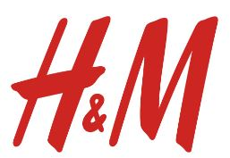

<!-- omit in toc -->
# Welcome to My World:
<!-- omit in toc -->
# Sections: (Section Links)
- [Population: 1, Person: Nathan Chung](#population-1-person-nathan-chung)
- [Some Stuff About Me](#some-stuff-about-me)

## Population: 1, Person: Nathan Chung

My **programming** and **coding** career pretty much began in 2021 when I entered college. I hadn't had much coding experience beforehand besides *AP CompSci Principles*. As such, my first CS class at UCSD was quite rough (*CSE 11*). I didn't think CSE 11 was going to be rough at all, I thought it'd be simple things like `print("Hello World!")`, but I was wrong. However, the CS courses that followed (*CSE 12, 30, 100*) were not too bad. At that point, coding wasn't the problem anymore, it was understanding concepts and how to implement them. Now, with CSE 110, I hope to better understand the position of a software engineer so that I could better forge my career path!

As someone, not sure who, once said:
> "Practice makes perfect isn't true, practice makes progress"

And so here I am, trying to practice to learn more :)

## Some Stuff About Me
Outside of programming, I like to listen to *music* (this could be pop, kpop, jpop, krnb, rnb, ballads, etc.), play *basketball*, watch *shows*, and *window shop*! Some clothing brands I like are:

Here's my **favorite** song of all time:
[song link](https://www.youtube.com/watch?v=dQw4w9WgXcQ&ab_channel=RickAstley)

Before we move on, check this out: [Click for surprise](surprise.md)

Let me rank some movies:
1. A Silent voice
2. Interstellar
3. Your Name

Before you leave this site, do these:
-  [x] Drink Water
-  [ ] Stretch for a little bit
-  [ ] Rest your eyes

Have a good day!